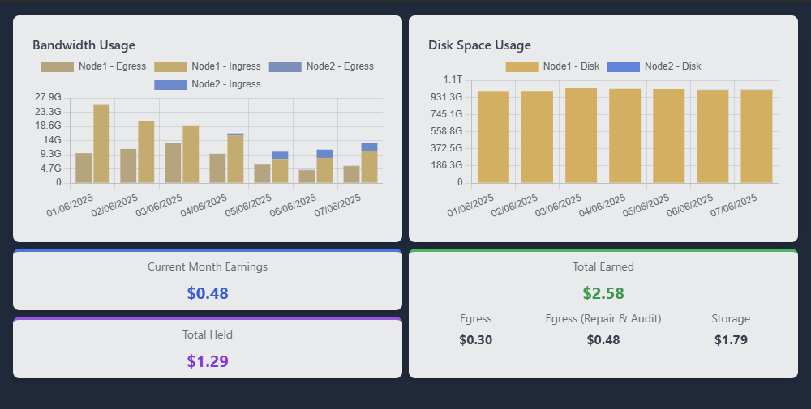

# Storj Multi-Node Dashboard

A lightweight and high-performance web dashboard for monitoring multiple Storj nodes simultaneously.
Includes basic caching & background refreshing



## Environment variables:
- `PORT`: Server listening port (default 80)
- `NODES` (recommended): Comma-separated list of nodes to monitor (example: `Node1=ADDR1:PORT1,Node2=ADDR2:PORT2,....`)

## Launch via Docker
   Minimal : 
   ```bash
    docker run --rm -p 8080:80 lalamefine/storej-multinode
   ```
   or with predefined nodes:
   ```bash
    docker run --rm -p 8080:80 -e NODES="Node1=192.168.1.30:14002,Node2=192.168.1.30:14003" lalamefine/storej-multinode
   ```

## 🖥️ Usage

1. Access the dashboard in your browser at `http://localhost:80` with URL parameters specifying your nodes if not set in environment variables:
   ```
   http://localhost:80/?Node1=ADDR1:PORT1&Node2=ADDR2:PORT2&Node3=ADDR3:PORT3&...
   ```

2. Parameter format:
   - Each URL parameter takes the form `NodeName=IPAddress:Port`
   - The node name can be customized according to your preferences
   - The address must point to the Storj node API (usually on port 14002)

## 🔄 Internal Operation

1. The server wait for incomming connections. 
2. It parses the NODES environement variable or fallback to parsing the URL parameters to determine which nodes to monitor
2. It retrieves data from each node via their respective APIs
3. A background task periodically refreshes the data and keeps it in cache
4. The user interface displays charts and statistics based on this data (the first loading may take some time)

## 📜 License

This project is under the MIT license